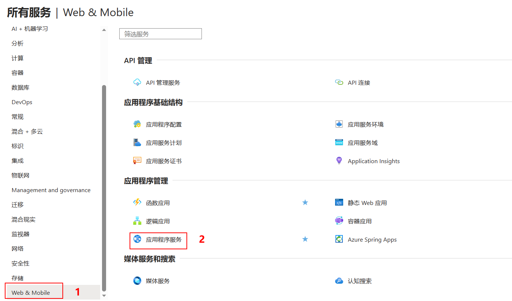
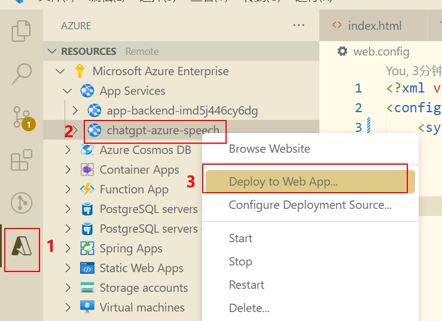

# chatgpt-azure-speech

本项目提供了一个可以借助Azure OpenAI和语音服务实现实时多语言对话的chatbot，仅需要您具备相关服务即可轻松配置使用。

使用效果请看：[微信文章]()

## 配置步骤
获取代码后，执行
``` bash
npm install
```
安装所需依赖模块后，打开App.tsx文件，请确保正确地配置API密钥到指定的地方，如下。


代码中适用了Azure SDK，可以简化整个过程。同时，确保程序能够处理多国语言的输入和输出，以实现多语言聊天的目标。 
完成上述步骤后，执行
``` bash
npm run start
```
你将拥有一个能说会道、精通80种语言的智能语音助手。虽然它可能没有人型机器人的外观，但在聊天能力方面绝对不逊色！ 

## 部署步骤

> 将本项目部署到azure中

官方教程：[快速入门：创建 Node.js Web 应用 - Azure App Service | Microsoft Learn](https://learn.microsoft.com/zh-cn/azure/app-service/quickstart-nodejs?pivots=development-environment-vscode&tabs=windows)

1. 在`azure`的`应用程序服务`中创建服务，名为`chatgpt-azure-speech`

   

2. 在`vscode`中安装插件`Azure Tools`

3. 打包：`npm run build`

4. 在`build`目录中创建`web.config`文件

   ```shell
   <?xml version="1.0"?>
   <configuration>
       <system.webServer>
           <rewrite>
               <rules>
                   <rule name="React Routes" stopProcessing="true">
                       <match url=".*" />
                       <conditions logicalGrouping="MatchAll">
                           <add input="{REQUEST_FILENAME}" matchType="IsFile" negate="true" />
                           <add input="{REQUEST_FILENAME}" matchType="IsDirectory" negate="true" />
                           <add input="{REQUEST_URI}" pattern="^/(api)" negate="true" />
                       </conditions>
                       <action type="Rewrite" url="/" />
                   </rule>
               </rules>
           </rewrite>
       </system.webServer>
   </configuration>
   ```

5. 部署项目

   